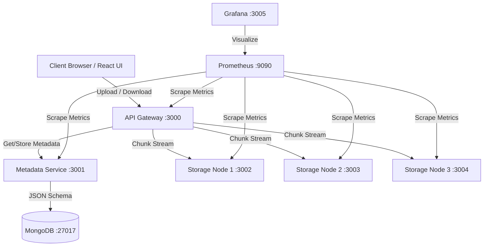
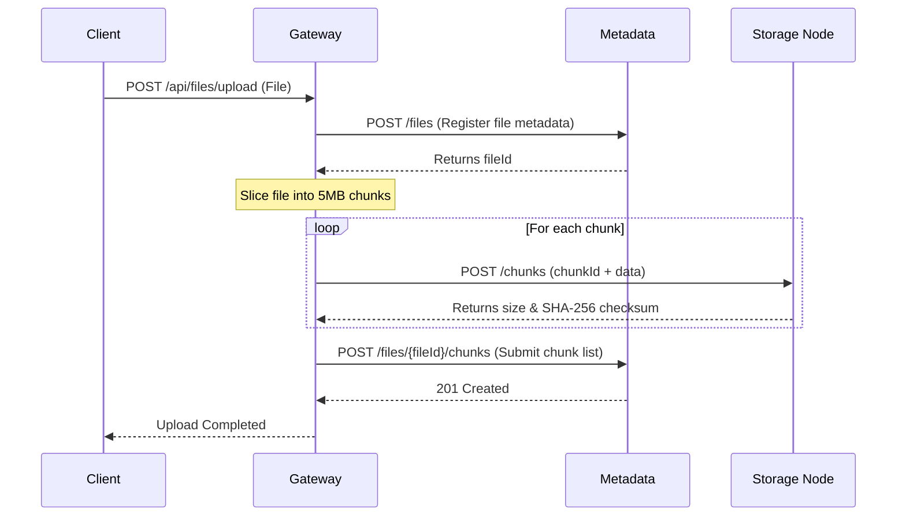

# Distributed File System (ChunkStore)

A highly scalable distributed file system with metadata management, file chunking, round-robin storage balancing, and active system monitoring — inspired by the architecture of GFS (Google File System) and HDFS.

---

## 🏗️ System Architecture

ShardVault is built on a modular, decoupled microservices architecture designed to handle large file storage by splitting files into smaller chunks and distributing them across multiple storage service nodes.



### 1. API Gateway (Port 3000)
- **Coordinator**: Serves as the single entrypoint for clients. Orchestrates file read, write, metadata lookup, and deletion.
- **Chunking Engine**: Automatically slices large binary files into fixed-size **5MB chunks** before distribution.
- **Load Balancer**: Utilizes a Round-Robin strategy to distribute file chunks across the configured active storage services.
- **Sequential Stream Reassembler**: Streams chunks from storage nodes in order and pipes them back to the client sequentially to optimize memory footprint during downloads.

### 2. Metadata Service (Port 3001)
- **Catalog Registry**: Manages the mapping database of file IDs, corresponding chunk lists, and the exact physical storage nodes where each chunk resides.
- **Storage Layer**: Backed by **MongoDB** with Mongoose models, tracking fields such as `filename`, `size`, `mimeType`, `replicationFactor`, and individual chunk `checksums` (SHA-256).

### 3. Storage Services (Ports 3002-3004)
- **Data Nodes**: Stateless services running on individual volumes that handle chunk storage.
- **Write Verification**: Computes `sha256` integrity checksums of the chunks upon receipt.
- **Direct Streaming**: Streams stored chunks back to the API Gateway using Node.js stream piping to avoid high memory overhead.

### 4. Monitoring (Ports 9090 & 3005)
- **Prometheus**: Automatically scrapes default Node.js runtimes and custom application metrics (e.g., HTTP request durations, file upload counters, chunk operation sizes).
- **Grafana**: Pulls from Prometheus to render real-time dashboard analytics.

---

## ⚡ Key System Data Flows

### A. Upload and Chunking Flow
1. **Client** uploads file via `POST /api/files/upload`.
2. **API Gateway** pre-registers the file metadata with the **Metadata Service** to get a unique `fileId`.
3. **API Gateway** splits the file buffer into **5MB segments**.
4. For each segment, a `chunkId` is generated, and a storage node is assigned via Round-Robin.
5. The chunk is uploaded to the target **Storage Service** via `POST /chunks`.
6. Once all chunks are saved, the gateway updates the Metadata Service with the final mapping array.



### B. Download and Reassembly Flow
1. **Client** requests `GET /api/files/:fileId/download`.
2. **API Gateway** queries **Metadata Service** to retrieve the ordered list of chunks.
3. For each chunk in the file mapping:
   - **API Gateway** requests the stream directly from the assigned storage node (`GET /chunks/:chunkId`).
   - **API Gateway** pipes the chunk stream into the client's HTTP response buffer with `{ end: false }`.
4. Once all chunks have completed streaming, the Gateway ends the response stream (`res.end()`).

---

## 🔌 Port Mapping & Configurations

| Service | Port | Endpoint / Dependency | Description |
| :--- | :---: | :--- | :--- |
| **Frontend** | `80` | Client UI | React SPA running on Nginx |
| **API Gateway** | `3000` | `/api/files/*` | Main routing & chunking backend |
| **Metadata Service** | `3001` | `/files/*` | Mapped to MongoDB |
| **Storage Service 1** | `3002` | `/chunks/*` | Chunk storage node 1 |
| **Storage Service 2** | `3003` | `/chunks/*` | Chunk storage node 2 |
| **Storage Service 3** | `3004` | `/chunks/*` | Chunk storage node 3 |
| **MongoDB** | `27017` | `mongodb://...` | Persistence DB |
| **Prometheus** | `9090` | `/metrics` scraper | System monitoring tool |
| **Grafana** | `3005` | Dashboard UI | Metrics visualization portal |

---

## 🚀 Getting Started

### Prerequisites
- Node.js 18 or higher
- Docker & Docker Compose

### Quickstart Installation
1. Install dependencies for the local packages:
   ```bash
   # Root backend services
   npm install

   # Frontend application
   cd frontend
   npm install
   cd ..
   ```

2. Run the entire microservices stack in containers:
   ```bash
   docker-compose up -d --build
   ```

3. Open your browser and navigate to:
   - **Web UI**: `http://localhost`
   - **Prometheus Metrics**: `http://localhost:9090`
   - **Grafana Dashboards**: `http://localhost:3005`

---

## 🛠️ Development & Testing

To run individual services outside Docker for local debugging:

```bash
# Start API Gateway (Port 3000)
npm run start

# Start Metadata Service (Port 3001)
npm run start:metadata

# Start Storage Service (Port 3002)
npm run start:storage

# Start React Dev Server (Port 3000 default mapping)
npm run start:frontend
```

Run test suite validation:
```bash
npm test
```
